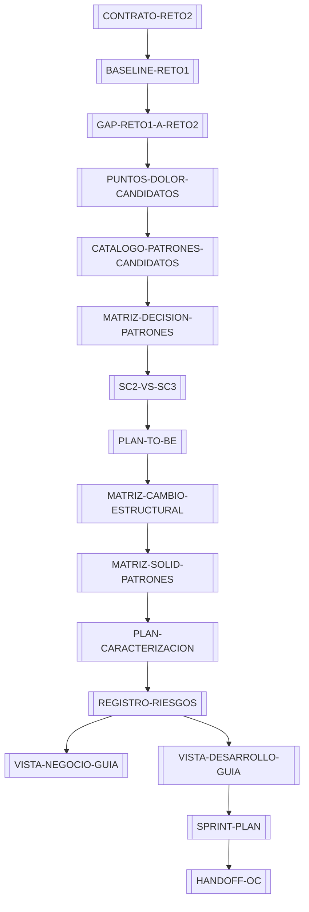

# Reto 2 — Patrones de Diseño Arquitectónico

MOC (Map of Content) principal del sprint. Este documento es el punto de entrada para humanos y para agentes que continúen el trabajo.

## Objetivo del sprint

Partiendo del diseño SOLID entregado en el Reto 1, detectar las rigideces que aún quedan, decidir qué patrones de diseño justifican una intervención real y preparar el TO-BE para implementar **SC-2 o SC-3** (no SC-1, que ya fue entregada).

## Estado actual

- Baseline confirmado: `deec502790af3d72eb9ff71ce0fe96a178e22c9d` (main).
- Worktree limpio.
- Build de `Bib_Hacienda` y `p_mvcHacienda`: PASS.
- Verificador `HaciendaNEW.Verification`: PASS (30 comprobaciones).
- Demo `HaciendaNEW.Demo`: PASS.
- Proyectos de caracterización ejecutables (`phase4/Characterization`): **no presentes en este HEAD**; solo existen los archivos `03-src/characterization/*.md` con las salidas.
- SC a implementar: **SC-3 Historia clínica - ADOPTADA / HUMAN-APPROVED (2026-09-04)**.
- Patrones adoptados: **Strategy, Observer y Chain of Responsibility - HUMAN-APPROVED (2026-09-04)**.
- Hallazgos humanos: **pendientes** (ver [[PUNTOS-DOLOR-CANDIDATOS]]).

## Mapa de conexiones

## Tabla de navegación

| Si buscas... | Lee... |
|---|---|
| Qué dice la rúbrica | [[CONTRATO-RETO2]] |
| Estado exacto del repo y qué se probó | [[BASELINE-RETO1]] |
| Qué cambia del Reto 1 al Reto 2 | [[GAP-RETO1-A-RETO2]] |
| Puntos de dolor detectados | [[PUNTOS-DOLOR-CANDIDATOS]] |
| Patrones evaluados | [[CATALOGO-PATRONES-CANDIDATOS]] |
| Decisión provisional de patrones | [[MATRIZ-DECISION-PATRONES]] |
| SC-2 vs SC-3 | [[SC2-VS-SC3]] |
| Diseño TO-BE provisional | [[PLAN-TO-BE]] |
| Cambios estructurales planificados | [[MATRIZ-CAMBIO-ESTRUCTURAL]] |
| Guardas SOLID por patrón | [[SOLID-GUARDRAILS]] |
| Plan de caracterización C24+ | [[PLAN-CARACTERIZACION]] |
| Matriz SOLID × patrones | [[MATRIZ-SOLID-PATRONES]] |
| Riesgos | [[REGISTRO-RIESGOS]] |
| Guía para la vista de negocio | [[VISTA-NEGOCIO-GUIA]] |
| Guía para la vista de desarrollo | [[VISTA-DESARROLLO-GUIA]] |
| Bitácora de IA del Reto 2 | [[BITACORA-IA-RETO2]] |
| Trazabilidad requisito → código → test | [[TRAZABILIDAD]] |
| Plan de sprint | [[SPRINT-PLAN]] |
| Definition of Done | [[DEFINITION-OF-DONE]] |
| Handoff para el siguiente agente | [[HANDOFF-OC]] |
| Preguntas de sustentación | [[PREGUNTAS-SUSTENTACION]] |

## Qué leer si eres humano

1. [[CONTRATO-RETO2]] para entregar lo que pide la rúbrica.
2. [[PUNTOS-DOLOR-CANDIDATOS]] para validar o rechazar los hallazgos de IA con tus propios ojos.
3. [[SC2-VS-SC3]] para tomar la decisión de SC.
4. [[MATRIZ-DECISION-PATRONES]] para decidir qué patrones adoptar.
5. [[SPRINT-PLAN]] para saber qué falta y cuándo.

## Qué leer si eres un agente

1. [[HANDOFF-OC]] — estado, decisiones confirmadas, decisiones pendientes y próximo comando.
2. [[BASELINE-RETO1]] — qué se probó y qué no.
3. [[PUNTOS-DOLOR-CANDIDATOS]] — puntos de dolor con rutas y líneas reales.
4. [[PLAN-TO-BE]] — dirección de diseño actual (no definitiva).
5. [[TRAZABILIDAD]] — cadena requisito → código → test → riesgo.

## Bloqueadores actuales

1. **Faltan hallazgos humanos.** Se reservaron HUMAN-P01, HUMAN-P02, HUMAN-P03 en [[PUNTOS-DOLOR-CANDIDATOS]].
2. **Las decisiones aprobadas deben implementarse y verificarse.**
4. **No hay proyectos de caracterización ejecutables.** Si el equipo quiere reproducir C01..C23, debe recuperar o reconstruir `03-src/phase4/Characterization`.

## Siguiente acción recomendada

Que cada integrante lea el código de `HaciendaNEW` y registre al menos un hallazgo propio en [[PUNTOS-DOLOR-CANDIDATOS]]; luego decidir SC-2 vs SC-3 en [[SC2-VS-SC3]].

## Conexiones

- [[BASELINE-RETO1]]
- [[CONTRATO-RETO2]]
- [[GAP-RETO1-A-RETO2]]
- [[PUNTOS-DOLOR-CANDIDATOS]]
- [[MATRIZ-DECISION-PATRONES]]
- [[PLAN-TO-BE]]
- [[SPRINT-PLAN]]
- [[HANDOFF-OC]]

## Evidencia externa

- [Diseño Reto 1](../02-diseno/DISENO-TO-BE.md)
- [Código NEW](../03-src/redisenado/HaciendaNEW/)
- [Rúbrica Reto 2](/home/chanda/Downloads/Reto2_Patrones_Enunciado_y_Rubrica.docx) *(DOCX fuera del repo)*
